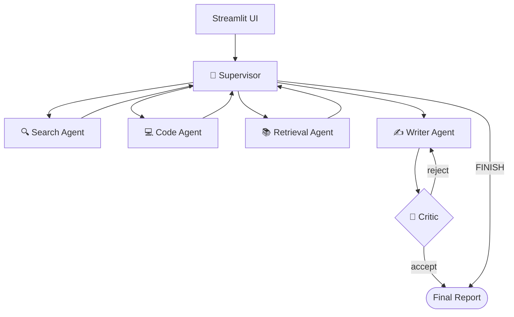

# Multi-Agent Research Assistant

[](https://github.com/WeiGuang-2099/Multi-Agent-system/actions/workflows/ci.yml)
[](https://www.python.org/downloads/)
[](LICENSE)
[](https://github.com/langchain-ai/langgraph)

A production-grade Multi-Agent research assistant built with **LangGraph** and
the **A2A (Agent-to-Agent) protocol**. A supervisor decomposes research tasks
and coordinates specialized agents for web search, sandboxed code execution,
retrieval-augmented generation, and report writing — with reflection,
Human-in-the-Loop approval, live streaming, full observability, and an
automated evaluation suite.

> Built as a portfolio project for AI engineering roles. See
> [`docs/architecture.md`](docs/architecture.md) for the design rationale and
> [`docs/adr/`](docs/adr/) for the key technical decisions.

---

## ✨ Highlights

| Capability | What it demonstrates |
|------------|---------------------|
| **Supervisor-Worker orchestration** | LangGraph `StateGraph` with structured-output routing |
| **Dual deployment** | Single-process LangGraph *and* distributed A2A microservices |
| **Live streaming UI** | `astream_events` → real-time "🔍 Searching / 💻 Coding / ✍️ Writing" |
| **Human-in-the-Loop** | `interrupt()`-based plan approval/edit/reject, checkpoint-resumable |
| **Reflection loop** | Critic agent self-reviews the report and triggers bounded revisions |
| **RAG knowledge base** | Chroma vector store + dedicated retrieval agent |
| **MCP integration** | Adapter to consume any Model Context Protocol server as tools |
| **Sandboxed code exec** | Docker isolation: no network, read-only, dropped caps, pids limit |
| **Observability** | Structured JSON logs + token/cost metrics + LangSmith tracing |
| **Cost control** | Cheap model for routing/critic, strong model for writing |
| **Evaluation suite** | Routing accuracy + keyword coverage + LLM-as-judge, `make eval` |
| **CI/CD** | GitHub Actions: lint (ruff) + tests + coverage + Docker build |

---

## 🏗 Architecture



See [`docs/architecture.md`](docs/architecture.md) for the full diagram and
the trade-off analysis (why supervisor-worker vs ReAct / Plan-Execute).

---

## 🚀 Quick Start

### Prerequisites
- Python ≥ 3.11
- Docker (for the code sandbox)
- API keys: an LLM provider (OpenAI / Anthropic / Google) + Tavily (search)

### 1. Configure
```bash
cp .env.example .env
# Edit .env:
#   DEFAULT_LLM_PROVIDER=openai
#   DEFAULT_LLM_MODEL=gpt-4o
#   OPENAI_API_KEY=sk-...
#   TAVILY_API_KEY=tvly-...
```

### 2. Install
```bash
make dev   # or: pip install -e ".[dev,rag]"
```

### 3. Build the sandbox image
```bash
make docker-build   # builds main + sandbox images
```

### 4. Run
```bash
# Streamlit UI (recommended for demo)
make run-ui

# CLI single task
make run-cli TASK="Research Python asyncio performance patterns"

# Full distributed stack (A2A over HTTP)
make docker-up
```

---

## 🧪 Testing & Evaluation

```bash
make test         # full unit + integration suite
make test-unit    # unit tests only (48 tests, hermetic)

make eval         # run the evaluation suite (needs API keys)
# → writes eval/results/eval-<timestamp>.json
```

The evaluation suite scores the system on three axes — see
[`eval/README.md`](eval/README.md):
- **Routing accuracy** (deterministic, vs expected agents)
- **Keyword coverage** (deterministic)
- **Report quality** (LLM-as-judge, 1–5)

---

## ⚙️ Optional Features (toggle in `.env`)

| Flag | Default | Effect |
|------|---------|--------|
| `HITL_ENABLED` | `false` | Pause after supervisor plan for user approval |
| `CRITIC_ENABLED` | `false` | Critic reflection loop after writer |
| `RAG_ENABLED` | `false` | Retrieval agent + Chroma knowledge base |
| `LANGSMITH_TRACING` | `false` | Full per-node tracing in LangSmith UI |

Index local documents for RAG:
```bash
python scripts/ingest.py data/sample_docs/
```

---

## 📁 Project Structure

```
.
├── src/
│   ├── agents/          # search, code, writer, critic, retrieval agents
│   ├── graph/           # StateGraph, supervisor routing, streaming callbacks
│   ├── llm/             # provider factory (cost-aware), prompts
│   ├── tools/           # Tavily search, Docker sandbox, RAG, MCP adapter
│   ├── observability/   # JSON logs, token/cost metrics, LangSmith tracing
│   ├── a2a/             # A2A JSON-RPC server + client (distributed mode)
│   └── ui/              # Streamlit app with live streaming + HITL panel
├── eval/                # evaluation dataset, LLM-judge, run_eval CLI
├── tests/               # unit + integration tests (pytest)
├── docs/                # architecture.md, ADRs
├── scripts/             # ingest.py (RAG indexing)
├── data/sample_docs/    # example knowledge-base content
├── docker-compose.yml   # full distributed stack
└── Makefile             # install / test / eval / run / docker targets
```

---

## 🎓 Design Decisions (interview talking points)

- **Why LangGraph?** Explicit state machine + checkpointing + `interrupt()` +
  streaming events in one library. See
  [`docs/adr/`](docs/adr/README.md#adr-0001-use-langgraph-for-multi-agent-orchestration).
- **Why supervisor-worker, not Plan-Execute?** Research is exploratory; the
  next step depends on results. Re-deciding after each step beats a static
  upfront plan. ([ADR-0002](docs/adr/README.md#adr-0002-supervisor-worker-topology-not-plan-execute))
- **Why a Docker sandbox?** Arbitrary LLM-generated code must never touch the
  host. Network-none + read-only + dropped caps is a strong, portable
  baseline. ([ADR-0003](docs/adr/README.md#adr-0003-docker-sandbox-for-code-execution))
- **Why a separate Critic agent?** A different model/prompt is more candid
  about gaps than self-critique; the bounded loop guarantees termination.
  ([ADR-0004](docs/adr/README.md#adr-0004-reflection-critic-loop-for-report-quality))

---

## 📦 Deployment (Demo)

The Streamlit UI is deployable to **Streamlit Community Cloud** or
**Hugging Face Spaces**. On sandboxless hosts the Code Agent falls back to a
restricted local-execution mode. See `docs/deployment.md` for step-by-step
instructions (coming soon).

---

## License

MIT