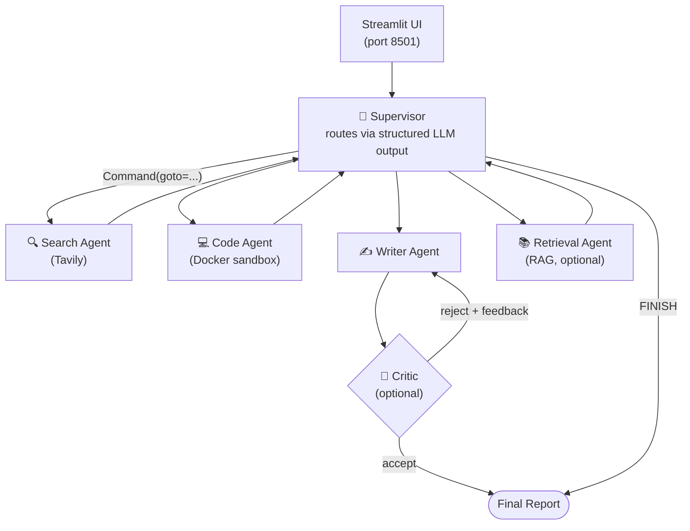
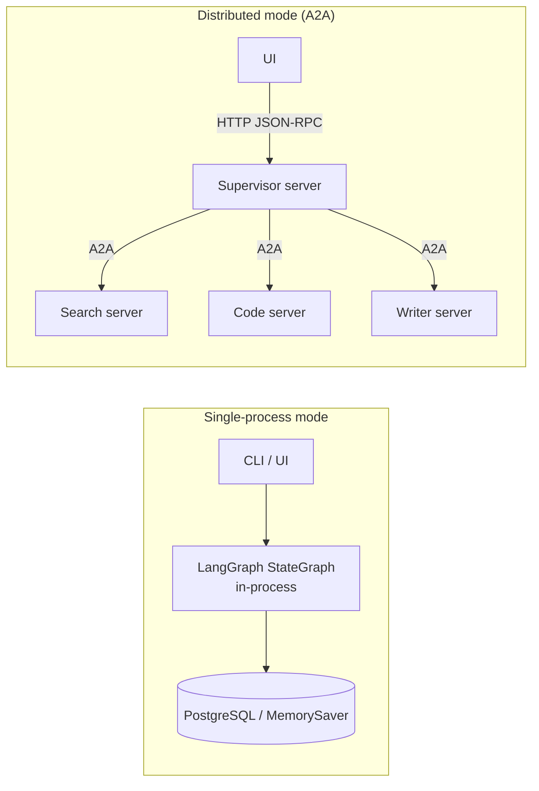

# Architecture

This document explains *why* the Multi-Agent Research Assistant is built the
way it is. It is the primary technical talking point for interviews — read it
alongside the source.

## High-Level Topology



The supervisor is the single orchestrator. Worker agents never talk to each
other directly — they always return control to the supervisor, which decides
the next step. This keeps routing logic in one place and makes the system
auditable.

## Why Supervisor-Worker (not ReAct / Plan-Execute)?

| Pattern | Pro | Con | Our take |
|---------|-----|-----|-----------|
| **Single ReAct loop** | Simple | No specialization; one prompt does everything | Too coarse for research (search + code + write need different tools) |
| **Plan-and-Execute** | Parallelizable; explicit DAG | Hard to replan when a step reveals new needs | Good fit for static tasks; research is inherently exploratory |
| **Supervisor-Worker** ✅ | Dynamic re-routing, per-agent tools, easy to add agents | More moving parts; supervisor is a hotspot | Best match for open-ended research where the next step depends on results |

The supervisor uses **structured LLM output** (`RouteDecision` pydantic model)
to pick the next agent deterministically rather than free-text parsing — this
is why our routing accuracy in `eval/` is reliably high.

## Dual Deployment Modes



The same agent implementations power both modes. In single-process mode,
LangGraph calls the agent functions directly. In distributed mode, each agent
runs behind an A2A (Agent-to-Agent) JSON-RPC server and the supervisor calls
them over HTTP. This lets the project demonstrate **both** a simple local dev
loop and a production-grade microservice topology.

## State & Checkpointing

`AgentState` (a `TypedDict`) holds:
- `messages` — the conversation, appended via LangGraph's `add_messages` reducer
- `search_results`, `code_results` — accumulated evidence
- `final_report`, `report_ready` — writer/critic outputs
- `critic_feedback`, `critic_rounds` — reflection loop bookkeeping
- `pending_plan`, `approved_plans` — Human-in-the-Loop audit trail

The graph is compiled with a **checkpointer**:
- `AsyncPostgresSaver` in production (durable across restarts, enables HITL resume)
- `MemorySaver` fallback when Postgres is unavailable (so local dev "just works")

## Reflection Loop (Critic)

When `CRITIC_ENABLED=true`, the writer no longer ends the graph. Instead:

```
writer -> critic -> (writer if score < 4.0 and rounds < max) | (end if accepted)
```

The critic returns a structured `CriticVerdict {score, passes, feedback}`. On
rejection, the feedback is written into `state.critic_feedback` and the writer
re-runs with a **revision** prompt that explicitly addresses the feedback.
This bounded loop (default max 2 rounds) demonstrably improves report quality
in the eval suite without risk of infinite cycling.

## Human-in-the-Loop

When `HITL_ENABLED=true`, the supervisor calls LangGraph `interrupt(plan)`
after producing each routing decision. The UI renders the plan and lets the
user approve, edit the target agent, or reject. Resuming injects the user's
choice back into the supervisor. Crucially, because the state is checkpointed,
the pause can span hours or process restarts.

## Observability

Three independent layers:

1. **Structured JSON logs** (`src/observability/logging_config.py`) — every
   log line is a JSON object, ready for ELK/Loki/Datadog.
2. **Token & cost metrics** (`src/observability/metrics.py`) — a LangChain
   callback records per-model usage to `logs/metrics.jsonl`.
3. **LangSmith tracing** (`src/observability/tracing.py`) — full per-node
   spans when `LANGSMITH_API_KEY` is set.

These are deliberately dependency-light (no Prometheus) so the project runs
anywhere; the README documents the one-line swap to Prometheus+Grafana.

## Security: Sandboxed Code Execution

The Code Agent never executes user/LLM-generated code directly. Every snippet
runs in a one-shot Docker container with:
- `--network none` (no outbound)
- `--memory 512m --cpus 1` (resource cap)
- `--cap-drop=ALL --security-opt no-new-privileges` (no privilege escalation)
- `--read-only` root filesystem + a small tmpfs `/tmp`
- `--pids-limit 50` (fork-bomb protection)
- a `--timeout` enforced by the host

This is the single most-asked-about production concern in interviews.

## Extending the System

Adding a new agent is intentionally mechanical:
1. Implement `YourAgent(BaseAgent)` with a `_run(state) -> str`.
2. Add an `async your_agent_node(state) -> Command` wrapper.
3. Register the node + conditional edges in `workflow.py` (gated behind a
   `settings.your_agent_enabled` flag).
4. Add the agent name to `RouteDecision` and the supervisor prompt.
5. Add an entry to `AGENT_META` in `graph/callbacks.py` for the UI icon.

The Critic (P1.8) and Retrieval (P1.7) agents were both added this way without
touching existing agent code — see `git log` for the diff size.